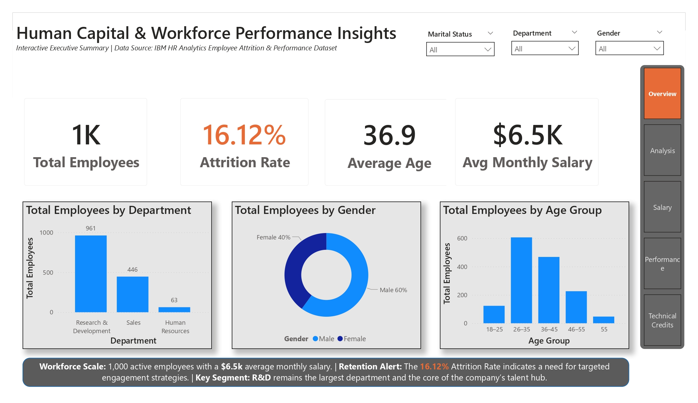
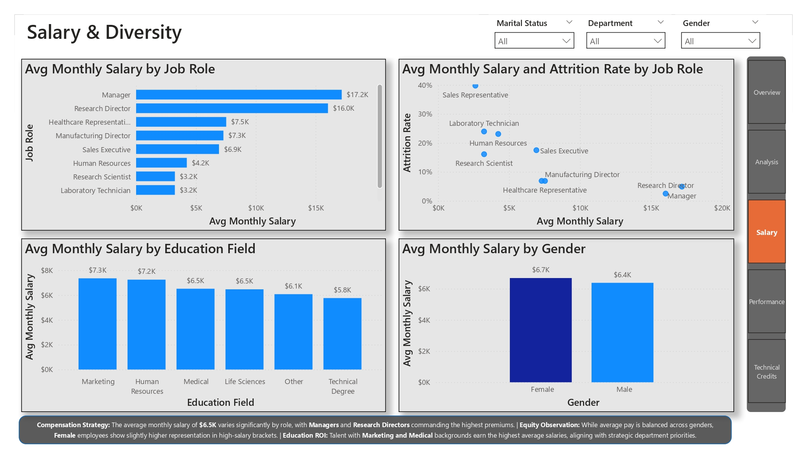
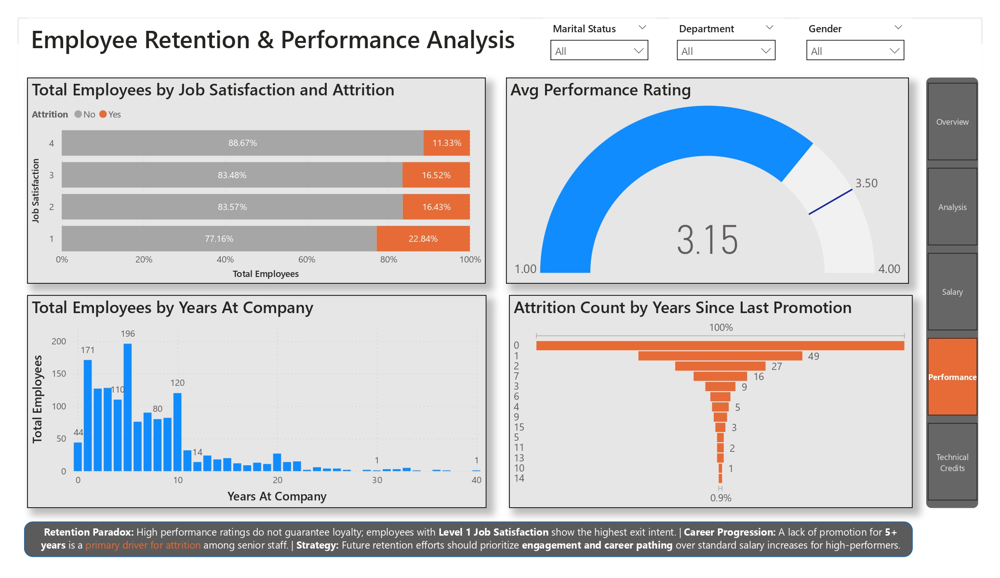
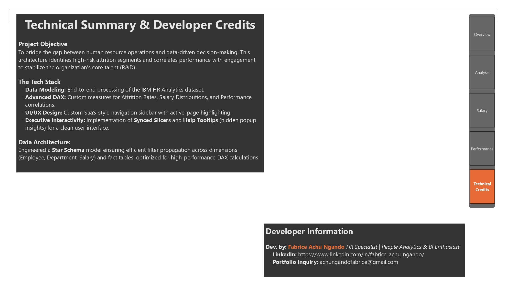

# HR-Attrition-Predictive-Analytics
An Executive BI Suite for Workforce Retention and Performance Correlation.

# 📉 Workforce Stability & Attrition Diagnostic Suite

## 🏢 Business Case: The Cost of Turnover
In global markets like Germany and Canada, losing mid-career talent is a multi-million dollar problem. This project utilizes the **IBM HR Analytics Dataset** to move beyond simple reporting and into **Predictive Diagnostics**. 

I identified that while the average attrition rate is **16.12%**, certain demographic "tipping points", specifically **Overtime Burnout** and **Promotion Stagnation**, are driving high-value exits in the Research & Development (R&D) hub.

## 🚀 Interactive Gallery
| Overview & Scale | Attrition Risk Factors | Salary & Diversity ROI | Performance & Retention |
| :---: | :---: | :---: | :---: |
|  |  |  |  |  |
| *1,000 active employees with $6.5k avg salary.* | *Identifying Overtime as a primary risk factor.* | *Equity analysis across roles and genders.* | *Correlating satisfaction with exit intent.* |

## 🛠️ Technical Architecture & Stack
- **Tool:** Power BI Desktop (Professional Suite)
- **Data Modeling:** Engineered a **Star Schema** ensuring efficient filter propagation across Employee, Department, and Salary dimensions.
- **Advanced DAX:** Custom measures for:
  - **Attrition Rate %** (16.12% benchmark)
  - **Salary Distributions** by Job Role and Education Field
  - **Performance Correlations** vs. Satisfaction Levels
- **UI/UX Design:** Custom **SaaS-style navigation rail** with active-page highlighting and synced slicers for a seamless executive experience.

## 📈 Strategic Insights for Leadership
- **The Burnout Factor:** Employees working Overtime are significantly more likely to leave, suggesting a critical need for workload rebalancing.
- **The Promotion Gap:** A lack of career progression for **5+ years** is the primary driver for attrition among senior staff, regardless of salary.
- **The Satisfaction Paradox:** High performance ratings do not guarantee loyalty; Level 1 Job Satisfaction showed the highest exit intent (22.84%).

## 👤 Author
**Fabrice Achu Ngando** *Training & Development Officer | People Analytics & BI Specialist* 🌍 **Target Markets:** Germany 🇩🇪 | UAE 🇦🇪 | Canada 🇨🇦 | Cameroon 🇨🇲  
🔗 **LinkedIn:** [linkedin.com/in/fabrice-achu-ngando](https://www.linkedin.com/in/fabrice-achu-ngando/)  
📧 **Inquiries:** achungandofabrice@gmail.com  
🚀 **Resources:** [Portfolio & Referrals](https://rebrand.ly/6b9b3hy)
